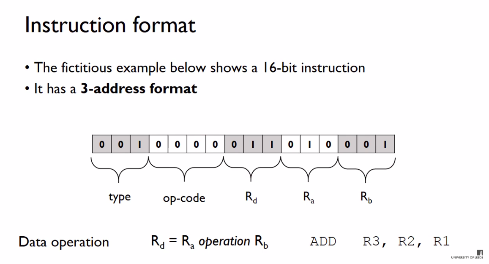

# csapp第三章机器数的表示

## machine fundamentals

学习资料：

1. [The Fetch-Execute Cycle: What's Your Computer Actually Doing?](https://www.youtube.com/watch?v=Z5JC9Ve1sfI&list=PL96C35uN7xGLLeET0dOWaKHkAlPsrkcha&index=7)
2. 极客时间 深入浅出计算机组成原理 17-19讲
3. 编码 17-19章
4. [alu-and-datapath]（https://www.geeksforgeeks.org/introduction-of-alu-and-data-path/0)

instruction format

opcode 指的是指令，例如`add`，对应不同的指令集有不同的数字表示。

## 第一次

1. 16个寄存器要清楚.
2. gcc -g
3. 操作数指示符的用法
4. x64的用法, mov d s
   byte word doubleword/l quadword

移位运算有是个汇编指令`SAL SHL SAR SHR`，分为左移右移，又有算术和逻辑之分，A为算术，H为逻辑，当然左移都是一样的。

这里讲一下算术和逻辑分别的应用场景。 ？？？？

首先逻辑右移高位补0，算术右移高位补符号位。c语言的规定指出无符号数执行的所有移位操作都是逻辑的。